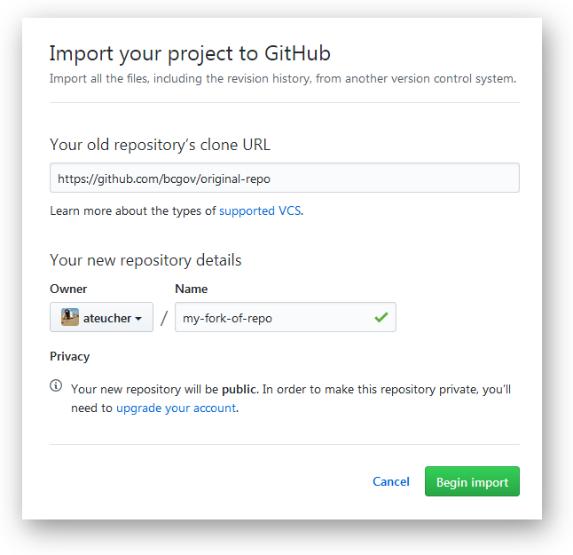

## "Forking" within the **bcgov** GitHub organization:

GitHub doesn't allow forking within an organization, so if you want to fork a **bcgov** repo *within* the **bcgov** organization, you can't use GitHub's forking feature. However you can achieve much the same result with a few simple steps. 

_**Note:** This workflow is intended for if you want to use an existing bcgov repo as a starting point for a new project in bcgov. If you want to fork beause you intend to submit a pull request back to the original repo, the workflow described below will not work. In that case you will need to fork outside of the organization, or ask an administrator on the repo to grant you write access, after which you can create a branch in the original repository and submit a pull request to master from there (see article on [GitHub Flow](https://help.github.com/articles/github-flow/)._

1. Go to the [Import Repository](https://github.com/new/import) page on GitHub. In the *'Old Repository URL'* field, enter the url of the repository you would like to fork (`https://github.com/bcgov/original-repo`). Set the *Owner* to **bcgov**, and choose a [unique name](Naming-Repos.md) for your "fork". Click **Begin Import** and a new repository will be created at **github.com/bcgov/my-fork-of-repo** which is an exact replica of **github.com/bcgov/bcgov/original-repo**:



2. Using the command line, clone your new repository to your computer:
```sh
$ git clone https://github.com/bcgov/my-fork-of-repo
```

3. Next you need to establish a link between your new repo and the original, so that if anything changes in the original repo you can pull those changes in easily. You do this by adding the original repo as a new remote (called `upstream`) on your local clone of your "fork":

    i. First make sure you are in the new repo folder:
      ```sh
      $ pwd
      # ~/your_own_unique_path
      $ cd my-fork-of-repo
      $ pwd
      # ~/your_own_unique_path/my-fork-of-repo
      ```

    ii. List current remotes for this repo (probably just `origin` pointing to `github.com/bcgov/my-fork-of-repo`)
      ```sh
      $ git remote -v
      # origin  https://github.com/bcgov/my-fork-of-repo.git (fetch)
      # origin  https://github.com/bcgov/my-fork-of-repo.git (push)
      ```

    iii. Add the *original repo* as a remote called `upstream` and verify it has been created properly:
      ```sh
      $ git remote add upstream https://github.com/bcgov/original-repo
      $ git remote -v
      # origin  https://github.com/bcgov/my-fork-of-repo.git (fetch)
      # origin  https://github.com/bcgov/my-fork-of-repo.git (push)
      # upstream  https://github.com/bcgov/original-repo.git (fetch)
      # upstream  https://github.com/bcgov/original-repo.git (push)
      ```

4. To get updates in your repo from the *upstream* (original) repo, follow these instructions on [syncing a fork](https://help.github.com/articles/syncing-a-fork/).
