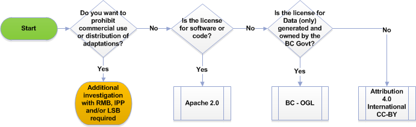

## Licensing

Licences are an important part of managing the sharing of intellectual property and this holds true for code and other material in GitHub. If you are planning to consume, share or contribute anything on GitHub, you will need to understand the requirements associated with the licences that are or will be attached. 

If you’re consuming code or other material, take note of whether the licence attached to the material places any restrictions on whether it can be modified or redistributed. It is important to note that if no licence is connected to the content, the material should be treated as if it has ‘all rights reserved’ and therefore cannot be used without express permission from the copyright owner.

If you’re planning to contribute to an existing, outside project, be sure to understand the licence applied to that project and what it requires of contributors. If the project seeks an assignment of copyright or submission of a separate contributor agreement, you must contact Legal Services Branch prior to taking any action.  

If you’re initiating a project or releasing previously created materials, you need to be aware that the Province can only license rights that it is in a legal position to grant to others.  The Province’s intellectual property rights in the content must be, at a minimum, equal to the rights under which the content will be licensed to third parties.  Within the BC government, four ‘open’ licences are approved for use that will likely cover the majority of projects coming forward. These licences are: 

- Apache 2 for publishing code 
- Creative Commons International 4.0 (CC BY) for use with other documentation, artistic resources and educational material
- Affero General Public Licence (AGPL) for works already containing that licence or for which maintaining open access to any modifications is critical
- Open Government Licence - BC (OGL-BC) for making government generated and owned data available to the public

Use of these licences is encouraged as they are widely accepted.  Following a consistent approach to licensing increases efficiency for both developers and consumers. Nevertheless, if your project would be better suited to a different licence, discuss your requirements with staff from the Intellectual Property Program. They will help answer your questions and advise on your need for any other legal or risk management advice.

### Authority to License

Under provincial policy, any licensing of BC government owned Intellectual Property requires the approval of the Intellectual Property Program (IPP), unless a ministry has either specific legislative authority or Treasury Board approval that enables them to license the intellectual property rights of the Province to third parties.  When IPP is the authority for the licensing, IPP will work with you to find the best fit to meet the licensing needs of the project.   

IPP’s approval process involves an examination of the development history of the content.  This takes the form of a conversation and can be a very quick process.  Initial questions include:

- Is the content created solely by B.C. government employees?
- Does the content contain only content owned by the B.C. government (i.e., have you ensured that it does not contain any third party content)?
- Can you confirm that there are no terms of use or exclusive licensing arrangements that would prohibit the Province from posting and licensing the content on GitHub?

### Preferred Licenses

**Apache 2.0** – Preferred for publishing code. It allows others to freely download and use the code, distribute it, to modify it and to distribute modified versions of the code. It preserves the “free and open” access to the originally licensed code or software while allowing users to commercialize any new modifications or derivative works, and therefore maximizes the economic opportunities for developers. It also includes terms to prevent contributors and distributors from suing for patent infringements. If users are developing commercial applications, they may bundle the original and derivative works together, but technically are only commercializing the modifications. Apache 2 requirements include that the same licence be applied to all unmodified parts (preserving open access to the original work) but allow users to choose a different licence if desired for the derivative work. 

**Creative Commons** – preferred for documentation or works that are not code. There are a number of different Creative Commons licences and the preferred licence is the most recent and most permissive licence (CC International v.4 - BY). This licence allows users to copy and distribute the work and make derivative works based on it provided that they give the licensor credit for the original work. Like the Apache 2 licence, it is permissive in that it does not require any modifications or derivative works to be licensed under the same licence, and allows commercialization of derivative works. It is generally suitable for content that does not contain code.

**BC – Open Government License (BC-OGL)** – preferred for making government generated and owned data available to the public. It provides users a worldwide, royalty free, perpetual, non-exclusive licence to use the information, including for commercial purposes. Like the Creative Commons BY licence, it requires attribution that the content includes information licensed under the BC-OGL. It is a suitable licence when making government-owned data available to the public, It is not likely to be the most appropriate choice for the majority of activities or projects in GitHub, as it is not designed for licensing code or contributions from third parties.

**Additional Available Licence**

**Affero General Public Licence (AGPL)** – a strong reciprocal or ‘copyleft’ licence that requires any work derived from the licensed code to be licensed under the same terms. There may be a few circumstances under which it will be necessary or appropriate to require ongoing release of the full source code of an application. The most common reason for the use of this licence will be that the content already contains this licence and requirement

### Choosing a License

The overview provided is intended to inform, not replace, the licensing review for each project.  

If your project is related to a community that typically uses a different licence than one of the preferred licences described above, or if you have any questions about which licence best applies to your project, contact IPP.

### Applying the License to your Code/Project

There are specific steps required to ensure you clearly communicate your licensing decision within a GitHub repository. Attach the appropriate LICENSE file directly into your repository before you do anything else.

The default license For code repositories is: Apache 2.0

Here is the boiler-plate you must put into the comments header of every source code file as well as the bottom of your README.md:

    Copyright 2016 Province of British Columbia

    Licensed under the Apache License, Version 2.0 (the "License");
    you may not use this file except in compliance with the License.
    You may obtain a copy of the License at 

       http://www.apache.org/licenses/LICENSE-2.0

    Unless required by applicable law or agreed to in writing, software
    distributed under the License is distributed on an "AS IS" BASIS,
    WITHOUT WARRANTIES OR CONDITIONS OF ANY KIND, either express or implied.
    See the License for the specific language governing permissions and
    limitations under the License.
   
For repos that are made up of docs, wikis and non-code stuff the default to use is Creative Commons Attribution 4.0 International, and should look like this at the bottom of your README.md:

 YOUR REPO NAME HERE by the Province of Britich Columbia is licensed under a <a rel="license" href="http://creativecommons.org/licenses/by/4.0/">Creative Commons Attribution 4.0 International License</a>.

and the code for the cc 4.0 footer looks like this:

     YOUR REPO NAME HERE by the Province of Britich Columbia
     is licensed under a <a rel="license" href="http://creativecommons.org/licenses/by/4.0/">
    Creative Commons Attribution 4.0 International License</a>.

----------

[Go back to the Contents List](README.md) or continue reading [Security](Security.md)

